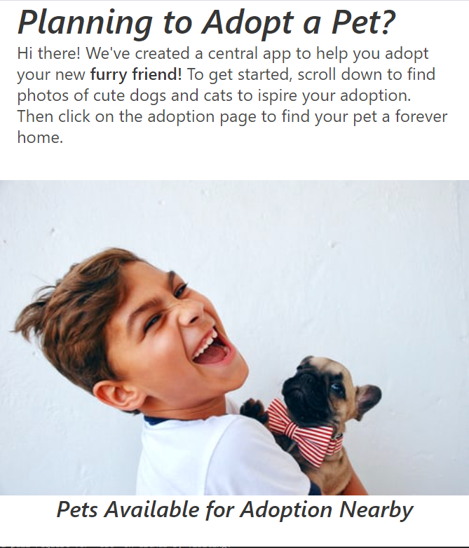
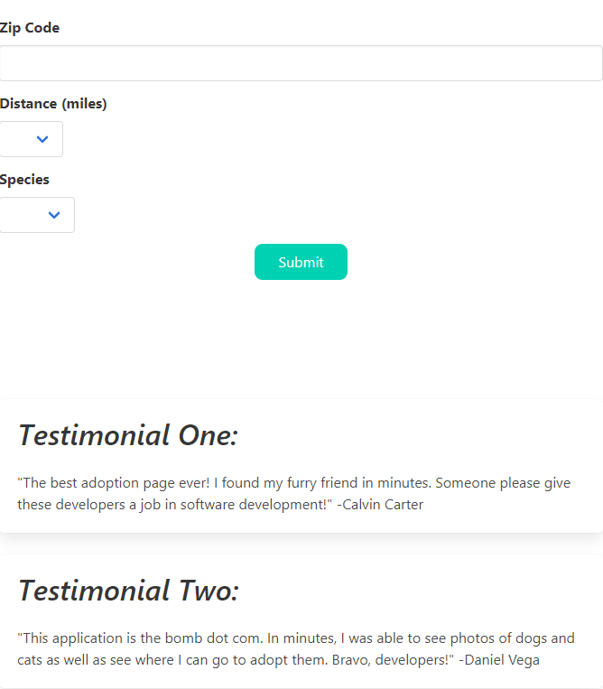
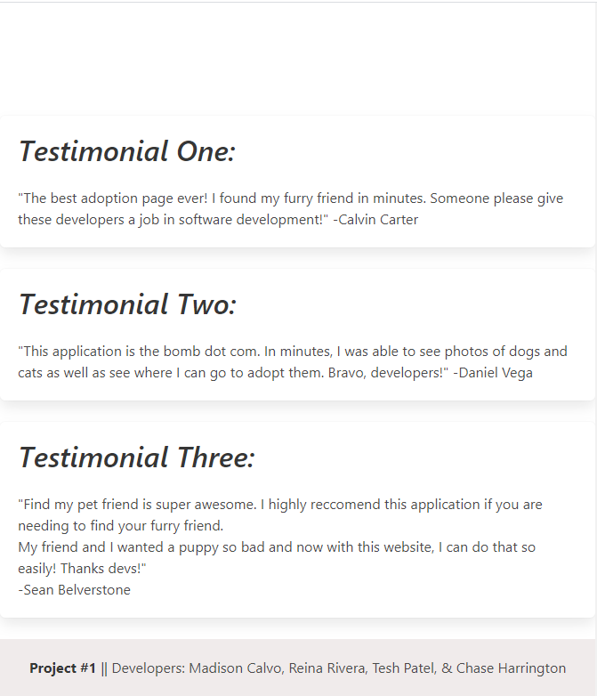
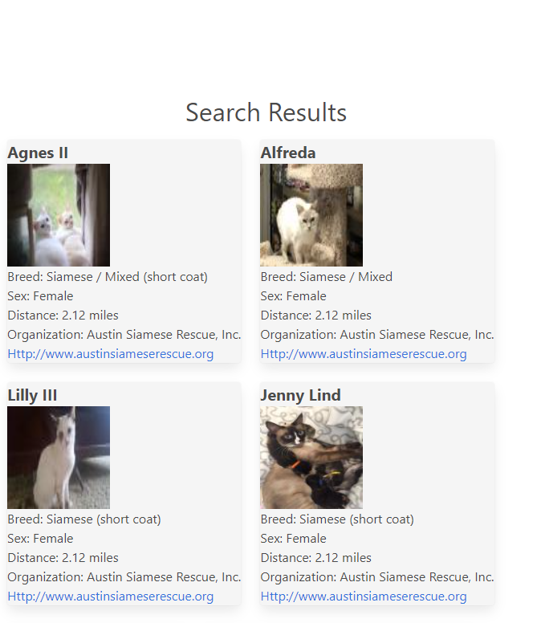
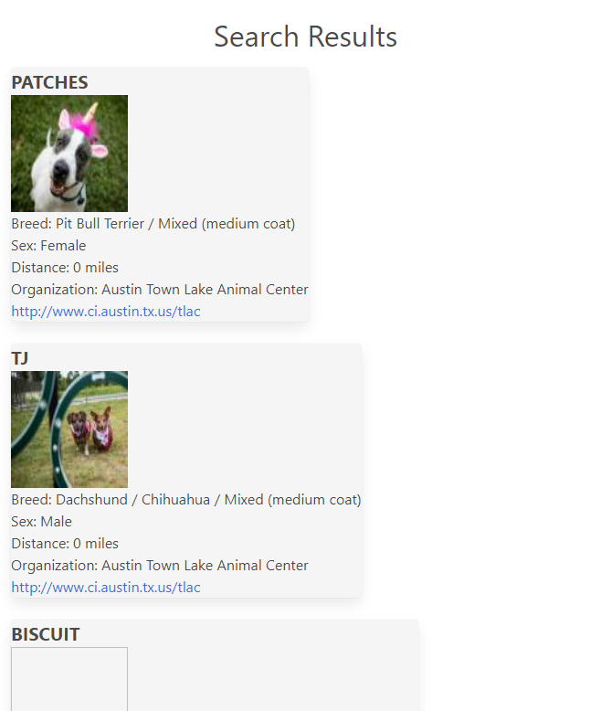

# Find My PETFriend:
This repo is composed of 3 pages
Index.html / style.css / script.js
Allow the user to look at dogs and cats, as well as look up locations near their zip code where they can adopt dogs or cats.
## User Story

## Github pages:
[Github Repo](https://github.com/priteshpatel823/Project_1)

[Github Pages](https://priteshpatel823.github.io/Project_1/)
## Langauges Used:
HTML
CSS
BOOTSTRAP
JAVASCRIPT
JQUERY
## Contributors:
Pritesh Patel
Madison Calvo
Reina Rivera
Chase Harrington
## License
No License required. These are public pages.